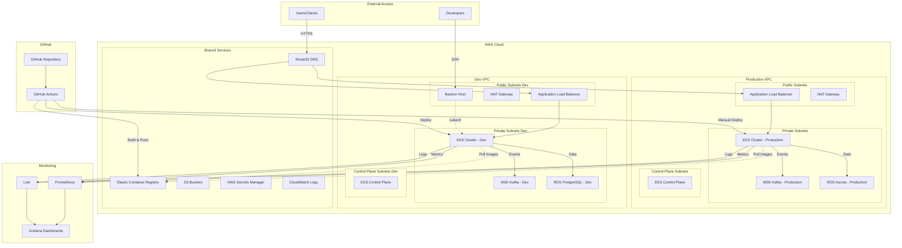
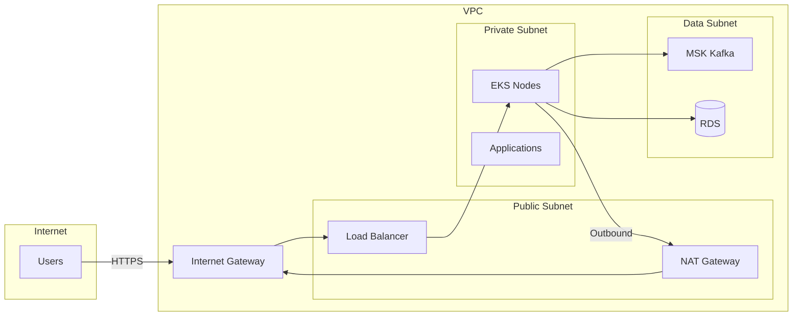
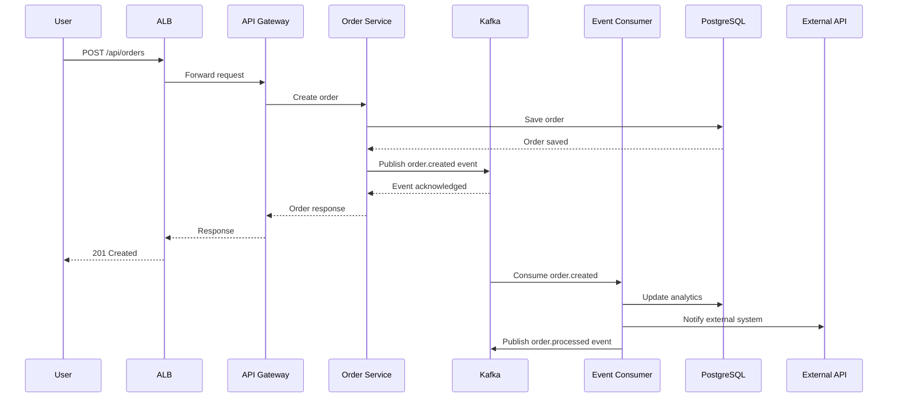
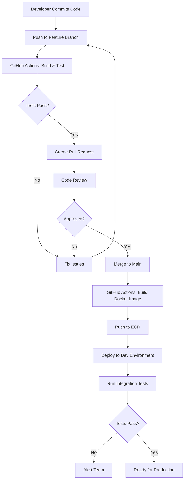
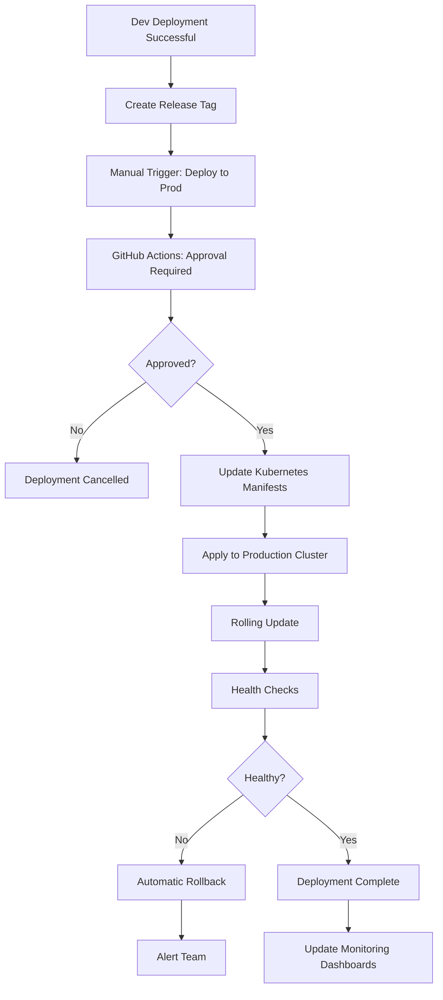

# 01. System Architecture Overview

## Table of Contents
1. [Introduction](#introduction)
2. [Architecture Principles](#architecture-principles)
3. [High-Level Architecture](#high-level-architecture)
4. [Component Architecture](#component-architecture)
5. [Network Architecture](#network-architecture)
6. [Data Flow Architecture](#data-flow-architecture)
7. [Deployment Workflow](#deployment-workflow)
8. [CI/CD Pipeline Architecture](#cicd-pipeline-architecture)
9. [Technology Stack](#technology-stack)
10. [Design Decisions & Tradeoffs](#design-decisions--tradeoffs)

---

## Introduction

This document provides a comprehensive overview of the enterprise DevOps infrastructure designed for deploying microservices applications on AWS. The system is built around modern cloud-native principles, leveraging Kubernetes for orchestration, Kafka for event streaming, and comprehensive automation for deployment and operations.

### System Goals

- **High Availability**: Multi-AZ deployment with automatic failover
- **Scalability**: Horizontal and vertical scaling at all layers
- **Security**: Defense-in-depth with network isolation, encryption, and least-privilege access
- **Observability**: Complete visibility into application and infrastructure metrics
- **Automation**: Full CI/CD with infrastructure as code
- **Cost Efficiency**: Optimized resource usage with spot instances and autoscaling
- **Developer Experience**: Fast feedback loops and easy deployment processes

### Target Workload

- **Application Type**: NestJS microservices
- **Communication Patterns**: REST APIs + Event-driven (Kafka)
- **Traffic Pattern**: Variable load with ability to handle spikes
- **Data Requirements**: Persistent storage for databases, ephemeral for compute
- **Availability SLA**: 99.9% uptime

---

## Architecture Principles

### 1. Cloud-Native Design
- Containerized applications
- Microservices architecture
- Declarative infrastructure
- API-driven configuration

### 2. Infrastructure as Code (IaC)
- All infrastructure defined in Terraform
- Version-controlled configurations
- Reproducible environments
- Automated provisioning

### 3. Immutable Infrastructure
- No manual changes to running systems
- Deployments through container image updates
- Infrastructure updates through Terraform
- Cattle, not pets

### 4. Security by Default
- Private subnets for workloads
- Encryption at rest and in transit
- Minimal IAM permissions
- Network segmentation
- Secret management

### 5. Observability First
- Structured logging
- Metrics collection at all layers
- Distributed tracing ready
- Proactive alerting

### 6. Environment Parity
- Consistent configurations across environments
- Same deployment process
- Automated promotion path
- Configuration differences managed through variables

---

## High-Level Architecture



### Architecture Overview Description

The architecture consists of two completely isolated environments (Dev and Production), each with their own VPC, EKS cluster, Kafka cluster, and database. This provides:

- **Complete Isolation**: No shared infrastructure between environments reduces blast radius
- **Environment Parity**: Same architecture in both environments ensures consistency
- **Security**: Private workloads with controlled ingress through load balancers
- **Observability**: Centralized monitoring across all environments
- **Automation**: GitHub Actions orchestrates the entire deployment pipeline

---

## Component Architecture

```
┌─────────────────────────────────────────────────────────────────┐
│                         AWS Cloud                                │
│                                                                   │
│  ┌────────────────────────────────────────────────────────────┐ │
│  │                    Production VPC                           │ │
│  │  ┌──────────────────────────────────────────────────────┐  │ │
│  │  │              EKS Cluster (Production)                 │  │ │
│  │  │                                                        │  │ │
│  │  │  ┌─────────────────────────────────────────────────┐ │  │ │
│  │  │  │         Namespace: production                   │ │  │ │
│  │  │  │                                                  │ │  │ │
│  │  │  │  ┌──────────────┐  ┌──────────────┐           │ │  │ │
│  │  │  │  │ API Gateway  │  │   Auth Svc   │           │ │  │ │
│  │  │  │  │  (NestJS)    │  │   (NestJS)   │           │ │  │ │
│  │  │  │  └──────┬───────┘  └──────┬───────┘           │ │  │ │
│  │  │  │         │                  │                    │ │  │ │
│  │  │  │  ┌──────▼───────┐  ┌──────▼───────┐           │ │  │ │
│  │  │  │  │  Order Svc   │  │  User Svc    │           │ │  │ │
│  │  │  │  │   (NestJS)   │  │   (NestJS)   │           │ │  │ │
│  │  │  │  └──────┬───────┘  └──────┬───────┘           │ │  │ │
│  │  │  │         │                  │                    │ │  │ │
│  │  │  │         └──────────┬───────┘                    │ │  │ │
│  │  │  │                    │                            │ │  │ │
│  │  │  │         ┌──────────▼───────────┐               │ │  │ │
│  │  │  │         │   Kafka Consumers    │               │ │  │ │
│  │  │  │         │  (Event Processors)  │               │ │  │ │
│  │  │  │         └──────────┬───────────┘               │ │  │ │
│  │  │  └────────────────────┼────────────────────────── │ │  │ │
│  │  │                        │                            │  │ │
│  │  └────────────────────────┼────────────────────────────┘  │ │
│  │                           │                                │ │
│  │  ┌────────────────────────▼─────────────────────────────┐ │ │
│  │  │           MSK Kafka Cluster (3 Brokers)              │ │ │
│  │  │    Topics: orders, users, notifications, events      │ │ │
│  │  └──────────────────────────────────────────────────────┘ │ │
│  │                                                             │ │
│  │  ┌──────────────────────────────────────────────────────┐ │ │
│  │  │           RDS Aurora PostgreSQL                       │ │ │
│  │  │         (Multi-AZ, 1 Writer + 1 Reader)              │ │ │
│  │  └──────────────────────────────────────────────────────┘ │ │
│  └─────────────────────────────────────────────────────────── │ │
│                                                                 │
│  ┌─────────────────────────────────────────────────────────┐  │
│  │               Shared Observability Stack                 │  │
│  │                                                           │  │
│  │  ┌─────────────┐  ┌─────────────┐  ┌─────────────┐    │  │
│  │  │ Prometheus  │  │    Loki     │  │   Grafana   │    │  │
│  │  │  (Metrics)  │  │   (Logs)    │  │ (Dashboards)│    │  │
│  │  └─────────────┘  └─────────────┘  └─────────────┘    │  │
│  └─────────────────────────────────────────────────────────┘  │
└───────────────────────────────────────────────────────────────┘
```

### Component Breakdown

#### 1. **Compute Layer (EKS)**
- **EKS Control Plane**: Managed by AWS, running in dedicated subnets
- **Worker Nodes**: EC2 instances running in private subnets across 3 AZs
- **Node Groups**: 
  - On-demand nodes for stable workloads
  - Spot instances for cost savings on flexible workloads
- **Add-ons**: 
  - AWS Load Balancer Controller
  - EBS CSI Driver
  - CoreDNS
  - kube-proxy

#### 2. **Event Streaming Layer (Kafka)**
- **MSK Cluster**: 3 brokers across 3 AZs (Production)
- **MSK Cluster**: 2 brokers across 2 AZs (Dev) - cost optimization
- **Topics**: Partitioned for parallelism
- **Consumer Groups**: For load distribution
- **Monitoring**: JMX metrics exported to Prometheus

#### 3. **Data Layer**
- **Production**: Aurora PostgreSQL (Multi-AZ, writer + reader)
- **Dev**: Single-instance RDS PostgreSQL
- **Backups**: Automated daily snapshots
- **Encryption**: At rest using AWS KMS

#### 4. **Ingress Layer**
- **Application Load Balancer**: L7 load balancing
- **AWS Load Balancer Controller**: Kubernetes integration
- **SSL/TLS**: Certificate management with ACM
- **WAF**: Optional web application firewall

#### 5. **Container Registry**
- **ECR**: Private Docker registry
- **Image Scanning**: Automated vulnerability scanning
- **Lifecycle Policies**: Automated cleanup of old images
- **Cross-region Replication**: Optional for DR

#### 6. **Observability Stack**
- **Prometheus**: Metrics collection and storage
- **Loki**: Log aggregation and querying
- **Grafana**: Unified dashboard for metrics and logs
- **AlertManager**: Alert routing and management

---

## Network Architecture

### VPC Design

Each environment (Dev and Production) has its own VPC with the following structure:

```
VPC: 10.0.0.0/16 (Production)  |  10.1.0.0/16 (Dev)

├── Public Subnets (for Load Balancers, NAT, Bastion)
│   ├── AZ-A: 10.X.1.0/24
│   ├── AZ-B: 10.X.2.0/24
│   └── AZ-C: 10.X.3.0/24
│
├── Private Subnets (for Application Workloads)
│   ├── AZ-A: 10.X.11.0/24
│   ├── AZ-B: 10.X.12.0/24
│   └── AZ-C: 10.X.13.0/24
│
├── Control Plane Subnets (for EKS Control Plane)
│   ├── AZ-A: 10.X.21.0/24
│   ├── AZ-B: 10.X.22.0/24
│   └── AZ-C: 10.X.23.0/24
│
└── Data Subnets (for Kafka and RDS)
    ├── AZ-A: 10.X.31.0/24
    ├── AZ-B: 10.X.32.0/24
    └── AZ-C: 10.X.33.0/24
```

### Network Connectivity



### Security Groups

1. **ALB Security Group**
   - Inbound: 443 (HTTPS) from 0.0.0.0/0
   - Outbound: Application ports to EKS nodes

2. **EKS Node Security Group**
   - Inbound: From ALB, from control plane, node-to-node
   - Outbound: All traffic (for pulling images, accessing AWS services)

3. **MSK Security Group**
   - Inbound: 9092 (plaintext), 9094 (TLS) from EKS nodes
   - Outbound: None required

4. **RDS Security Group**
   - Inbound: 5432 (PostgreSQL) from EKS nodes
   - Outbound: None required

5. **Bastion Security Group**
   - Inbound: 22 (SSH) from specific IPs
   - Outbound: 443 (HTTPS) to EKS API, SSH to private resources

---

## Data Flow Architecture

### Request/Response Flow

```
1. User Request Flow:
   User → Route53 → ALB → Ingress Controller → Service → Pod → Database
   
2. Response Flow:
   Database → Pod → Service → Ingress Controller → ALB → Route53 → User
```

### Event-Driven Flow

```
1. Event Production:
   API Service → Kafka Producer → MSK Topic → Partition
   
2. Event Consumption:
   Partition → Kafka Consumer (Pod) → Process Event → Database/External API
   
3. Event Chaining:
   Service A → Kafka Topic 1 → Service B → Kafka Topic 2 → Service C
```

### Complete Data Flow Diagram



### Logging and Metrics Flow

```
Application Logs → stdout → Promtail → Loki → Grafana
Application Metrics → /metrics endpoint → Prometheus → Grafana
Infrastructure Metrics → Node Exporter → Prometheus → Grafana
Kafka Metrics → JMX Exporter → Prometheus → Grafana
```

---

## Deployment Workflow

### Development Workflow



### Production Deployment Workflow



### Rollback Workflow

```
1. Detection:
   Monitor alerts → PagerDuty → On-call engineer
   
2. Decision:
   Assess severity → Decide to rollback
   
3. Execution:
   kubectl rollout undo deployment/service-name
   OR
   GitHub Actions: Deploy Previous Version
   
4. Verification:
   Check metrics → Verify health → Close incident
```

---

## CI/CD Pipeline Architecture

### Pipeline Overview

```
┌──────────────────────────────────────────────────────────────────┐
│                        GitHub Repository                          │
├──────────────────────────────────────────────────────────────────┤
│  Feature Branch → Pull Request → Main Branch → Release Tag        │
└──────────────┬───────────────────────────────────────────────────┘
               │
               ▼
┌──────────────────────────────────────────────────────────────────┐
│                       GitHub Actions                              │
├──────────────────────────────────────────────────────────────────┤
│                                                                    │
│  ┌────────────────────────────────────────────────────────────┐  │
│  │              Build & Test Pipeline (PR)                    │  │
│  │  1. Checkout code                                          │  │
│  │  2. Setup Node.js                                          │  │
│  │  3. Install dependencies                                   │  │
│  │  4. Run linting                                            │  │
│  │  5. Run unit tests                                         │  │
│  │  6. Build application                                      │  │
│  │  7. Run security scans                                     │  │
│  └────────────────────────────────────────────────────────────┘  │
│                                                                    │
│  ┌────────────────────────────────────────────────────────────┐  │
│  │         Docker Build & Push Pipeline (Main)                │  │
│  │  1. Checkout code                                          │  │
│  │  2. Login to ECR                                           │  │
│  │  3. Build Docker image                                     │  │
│  │  4. Tag with commit SHA and latest                         │  │
│  │  5. Push to ECR                                            │  │
│  │  6. Scan image for vulnerabilities                         │  │
│  └────────────────────────────────────────────────────────────┘  │
│                                                                    │
│  ┌────────────────────────────────────────────────────────────┐  │
│  │          Deploy to Dev Pipeline (Main)                     │  │
│  │  1. Update Kubernetes manifests                            │  │
│  │  2. Configure kubectl for Dev cluster                      │  │
│  │  3. Apply manifests                                        │  │
│  │  4. Wait for rollout completion                            │  │
│  │  5. Run smoke tests                                        │  │
│  │  6. Update deployment status                               │  │
│  └────────────────────────────────────────────────────────────┘  │
│                                                                    │
│  ┌────────────────────────────────────────────────────────────┐  │
│  │       Deploy to Production Pipeline (Manual)               │  │
│  │  1. Require manual approval                                │  │
│  │  2. Update Kubernetes manifests                            │  │
│  │  3. Configure kubectl for Prod cluster                     │  │
│  │  4. Apply manifests with rolling update                    │  │
│  │  5. Wait for rollout completion                            │  │
│  │  6. Run smoke tests                                        │  │
│  │  7. Update deployment status                               │  │
│  │  8. Send Slack notification                                │  │
│  └────────────────────────────────────────────────────────────┘  │
│                                                                    │
│  ┌────────────────────────────────────────────────────────────┐  │
│  │           Terraform Pipeline (Infrastructure)              │  │
│  │  1. Terraform fmt check                                    │  │
│  │  2. Terraform init                                         │  │
│  │  3. Terraform validate                                     │  │
│  │  4. Terraform plan                                         │  │
│  │  5. Post plan as PR comment                                │  │
│  │  6. On merge: Terraform apply (with approval)              │  │
│  └────────────────────────────────────────────────────────────┘  │
└──────────────┬───────────────────────────────────────────────────┘
               │
               ▼
┌──────────────────────────────────────────────────────────────────┐
│                         AWS Resources                             │
├──────────────────────────────────────────────────────────────────┤
│  ECR → EKS (Dev) → EKS (Prod)                                    │
└──────────────────────────────────────────────────────────────────┘
```

### Pipeline Triggers

| Event | Pipeline | Environment | Approval Required |
|-------|----------|-------------|-------------------|
| Pull Request | Build & Test | N/A | No |
| Push to Main | Build + Deploy | Dev | No |
| Release Tag | Build + Deploy | Production | Yes |
| Terraform PR | Plan | N/A | No |
| Terraform Merge | Apply | Specified | Yes |

---

## Technology Stack

### Core Infrastructure

| Component | Technology | Purpose |
|-----------|-----------|---------|
| Cloud Provider | AWS | Complete cloud infrastructure |
| Container Orchestration | Amazon EKS | Kubernetes cluster management |
| Container Registry | Amazon ECR | Private Docker image storage |
| Event Streaming | Amazon MSK | Managed Kafka service |
| Database | Amazon RDS/Aurora | Relational database |
| Load Balancing | AWS ALB | Layer 7 load balancing |
| DNS | Amazon Route53 | Domain name system |
| Object Storage | Amazon S3 | File and backup storage |

### Infrastructure as Code

| Component | Technology | Purpose |
|-----------|-----------|---------|
| IaC Tool | Terraform | Infrastructure provisioning |
| State Storage | S3 + DynamoDB | Terraform state management |
| Module Registry | Git repositories | Reusable Terraform modules |

### CI/CD

| Component | Technology | Purpose |
|-----------|-----------|---------|
| CI/CD Platform | GitHub Actions | Automation workflows |
| Authentication | OIDC | Secure AWS access from GitHub |
| Artifact Storage | ECR | Container image storage |
| Deployment Tool | kubectl/Helm | Kubernetes deployments |

### Application Stack

| Component | Technology | Purpose |
|-----------|-----------|---------|
| Runtime | Node.js 20 LTS | JavaScript runtime |
| Framework | NestJS | Microservices framework |
| Event Streaming | KafkaJS | Kafka client library |
| Database Client | TypeORM/Prisma | Database ORM |
| API Documentation | Swagger/OpenAPI | API documentation |

### Observability

| Component | Technology | Purpose |
|-----------|-----------|---------|
| Metrics | Prometheus | Metrics collection and storage |
| Log Aggregation | Loki | Log collection and querying |
| Visualization | Grafana | Dashboards and alerts |
| Log Shipping | Promtail | Log forwarding to Loki |
| Exporters | node-exporter, kube-state-metrics | System and Kubernetes metrics |

### Security

| Component | Technology | Purpose |
|-----------|-----------|---------|
| Secret Management | AWS Secrets Manager | Secure secret storage |
| IAM for Pods | IRSA | Pod-level AWS permissions |
| Image Scanning | ECR Scanning | Vulnerability detection |
| Network Policies | Calico/AWS VPC CNI | Pod network segmentation |
| Certificate Management | AWS ACM | SSL/TLS certificates |

---

## Design Decisions & Tradeoffs

### 1. Separate VPCs vs Shared VPC

**Decision**: Separate VPCs for Dev and Production

**Rationale**:
- ✅ **Complete isolation** between environments
- ✅ **Reduced blast radius** - issues in dev don't affect prod
- ✅ **Independent networking** - different CIDR ranges, security groups
- ✅ **Easier compliance** - clear environment boundaries
- ❌ **Higher cost** - duplicate NAT gateways, load balancers
- ❌ **More complexity** - manage multiple VPCs

**Alternative**: Shared VPC with namespace isolation
- Lower cost (shared NAT, etc.)
- Single network management
- Higher risk of cross-contamination

### 2. Amazon MSK vs Self-Managed Kafka (Strimzi)

**Decision**: Amazon MSK for Production, optional Strimzi for Dev/Learning

**MSK Advantages**:
- ✅ Fully managed (patching, scaling, monitoring)
- ✅ Multi-AZ by default
- ✅ Integrated with AWS services
- ✅ Automated backups
- ❌ Higher cost (~$400-600/month)
- ❌ Less control over configuration

**Strimzi (Self-Managed) Advantages**:
- ✅ Full control over Kafka configuration
- ✅ Lower cost (only EC2/EBS costs)
- ✅ Better for learning Kafka internals
- ✅ Can run on spot instances
- ❌ Operational overhead (upgrades, monitoring)
- ❌ You manage high availability

**Recommendation**: 
- Production: MSK (reliability > cost)
- Dev: Strimzi (learning + cost savings)

### 3. EKS Node Types: On-Demand vs Spot

**Decision**: Mixed node groups - On-Demand for critical, Spot for flexible workloads

**Strategy**:
- On-Demand nodes (30%): Stateful services, Kafka consumers with offset management
- Spot instances (70%): Stateless APIs, batch jobs, non-critical workloads

**Benefits**:
- 60-70% cost savings on compute
- High availability with mixed capacity
- Automatic spot instance management by EKS

**Implementation**:
- Use node selectors and taints/tolerations
- Configure pod disruption budgets
- Handle interruptions gracefully

### 4. Cluster Autoscaler vs Karpenter

**Decision**: Start with Cluster Autoscaler, migrate to Karpenter for advanced use cases

**Cluster Autoscaler**:
- ✅ Mature and stable
- ✅ Easier to configure
- ✅ Works with node groups
- ❌ Slower scaling
- ❌ Less flexible instance selection

**Karpenter**:
- ✅ Faster scaling (seconds vs minutes)
- ✅ Better bin-packing
- ✅ Automatically chooses optimal instance types
- ✅ Consolidation feature reduces waste
- ❌ Newer (less battle-tested)
- ❌ Steeper learning curve

**Recommendation**: Cluster Autoscaler initially, evaluate Karpenter after 3-6 months

### 5. Helm vs Kustomize vs Plain Manifests

**Decision**: Kustomize for environment-specific configurations, Helm for third-party tools

**Kustomize**:
- ✅ Built into kubectl
- ✅ Simple overlay pattern
- ✅ No templating language
- ✅ Good for environment variations

**Helm**:
- ✅ Package manager for Kubernetes
- ✅ Rich ecosystem of charts
- ✅ Version management
- ✅ Best for third-party applications (Prometheus, Kafka, etc.)

**Plain Manifests**:
- ✅ Simplest to understand
- ❌ Difficult to manage variations
- ❌ Lots of duplication

**Recommendation**:
- Application deployments: Kustomize
- Infrastructure components (monitoring, Kafka): Helm
- Simple single-environment resources: Plain manifests

### 6. Multi-Cluster vs Single Cluster with Namespaces

**Decision**: Multi-cluster (one per environment)

**Rationale**:
- ✅ Complete isolation
- ✅ Different Kubernetes versions possible
- ✅ Independent upgrade paths
- ✅ Better security boundary
- ❌ Higher cost (2x control plane)
- ❌ More complex management

**Alternative**: Single cluster with namespace isolation
- Lower cost
- Simpler operations
- Risk of resource contention
- Shared control plane (single point of failure)

### 7. Aurora vs RDS PostgreSQL

**Decision**: Aurora for Production, standard RDS for Dev

**Aurora Advantages**:
- ✅ Better performance (5x throughput)
- ✅ Storage auto-scaling
- ✅ Fast failover (<30 seconds)
- ✅ Up to 15 read replicas
- ❌ Higher cost (~20-30% more)

**Standard RDS Advantages**:
- ✅ Lower cost
- ✅ Simpler configuration
- ✅ Good enough for dev/staging
- ❌ Slower failover
- ❌ Max 5 read replicas

### 8. GitOps (ArgoCD) vs GitHub Actions Direct Deployment

**Decision**: GitHub Actions for initial setup, ArgoCD optional for advanced users

**GitHub Actions**:
- ✅ Simpler to start
- ✅ Familiar to developers
- ✅ Integrated with CI
- ❌ Not true GitOps
- ❌ Manual kubectl commands

**ArgoCD**:
- ✅ True GitOps - Git as source of truth
- ✅ Automatic drift detection
- ✅ Better for complex deployments
- ✅ Web UI for visualization
- ❌ Additional component to manage
- ❌ Steeper learning curve

**Recommendation**: Start with GitHub Actions, adopt ArgoCD as team matures

---

## Summary

This architecture provides a solid foundation for running production-grade microservices on AWS with complete automation, observability, and security. The design prioritizes:

1. **Reliability**: Multi-AZ deployment, automated failover, health checks
2. **Security**: Private networks, encryption, least-privilege access
3. **Scalability**: Autoscaling at all layers, from pods to infrastructure
4. **Observability**: Complete visibility into system behavior
5. **Cost Efficiency**: Spot instances, right-sizing, autoscaling
6. **Developer Experience**: Fast deployments, clear feedback, easy rollbacks

The architecture is designed to be:
- **Beginner-friendly**: Clear separation of concerns, well-documented
- **Production-ready**: Battle-tested patterns, high availability
- **Cost-conscious**: Optimizations without sacrificing reliability
- **Extensible**: Easy to add new services, scale to new regions

---

## Next Steps

1. **Review Infrastructure Components**: Read [02-infrastructure-components.md](./02-infrastructure-components.md) for detailed specifications
2. **Understand Network Design**: See [03-network-architecture.md](./03-network-architecture.md) for VPC, subnet, and security group details
3. **Learn Security Model**: Review [04-security-model.md](./04-security-model.md) for comprehensive security strategy
4. **Start Implementation**: Follow [20-step-by-step-implementation.md](./20-step-by-step-implementation.md) when ready to build

---

[← Back to README](../README.md) | [Next: Infrastructure Components →](./02-infrastructure-components.md)
