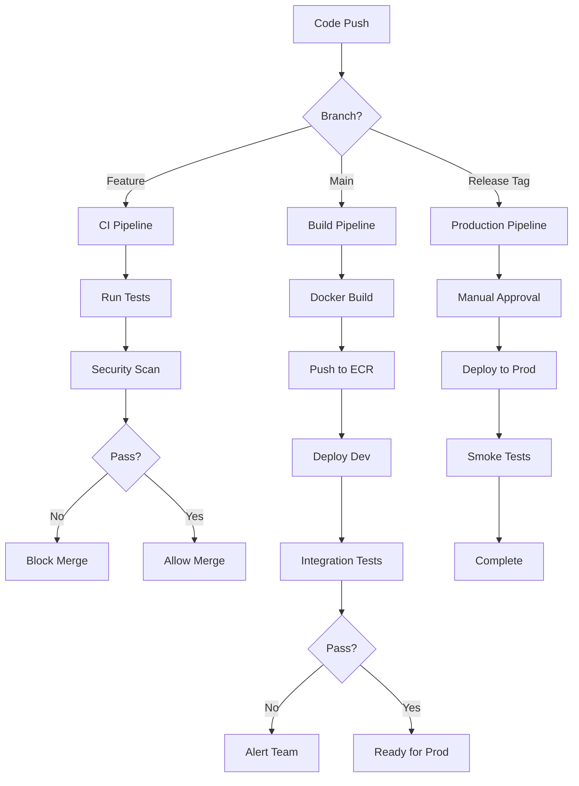

# 10. CI/CD Pipeline with GitHub Actions

## Table of Contents
1. [Overview](#overview)
2. [GitHub Actions Architecture](#github-actions-architecture)
3. [Repository Structure](#repository-structure)
4. [OIDC Authentication Setup](#oidc-authentication-setup)
5. [Build and Test Pipeline](#build-and-test-pipeline)
6. [Docker Build and Push Pipeline](#docker-build-and-push-pipeline)
7. [Development Deployment Pipeline](#development-deployment-pipeline)
8. [Production Deployment Pipeline](#production-deployment-pipeline)
9. [Terraform Pipeline](#terraform-pipeline)
10. [Workflow Examples](#workflow-examples)
11. [Secrets Management](#secrets-management)
12. [Best Practices](#best-practices)

---

## Overview

This document provides complete GitHub Actions workflows for implementing CI/CD across the entire infrastructure, from application code to infrastructure as code.

### Pipeline Goals

- **Fast Feedback**: Developers get feedback within minutes
- **Automated Testing**: Every commit is tested
- **Secure**: OIDC authentication, no long-lived credentials
- **Traceable**: Full audit trail of deployments
- **Rollback-capable**: Easy reversion to previous versions
- **Environment Parity**: Same pipeline logic for dev and prod

### Pipeline Architecture

```
┌─────────────────────────────────────────────────────────────┐
│                    GitHub Repository                         │
│                                                               │
│  Feature Branch → Pull Request → Main → Release Tag          │
└───────────┬─────────────────────────────────────────────────┘
            │
            ├─ On Pull Request
            │  ├─ Lint & Test
            │  ├─ Security Scan
            │  └─ Build Validation
            │
            ├─ On Push to Main
            │  ├─ Build Docker Image
            │  ├─ Push to ECR
            │  ├─ Deploy to Dev
            │  └─ Integration Tests
            │
            └─ On Release Tag
               ├─ Build & Push (if needed)
               ├─ Manual Approval
               ├─ Deploy to Production
               └─ Smoke Tests
```

---

## GitHub Actions Architecture

### Workflow Types

| Workflow | Trigger | Purpose | Approval Required |
|----------|---------|---------|-------------------|
| `ci.yml` | Pull Request | Build, test, security scan | No |
| `build.yml` | Push to main | Build Docker image, push to ECR | No |
| `deploy-dev.yml` | Push to main | Auto-deploy to dev | No |
| `deploy-prod.yml` | Release tag / Manual | Deploy to production | Yes |
| `terraform.yml` | PR to `infrastructure/**` | Plan and apply infrastructure | Yes (on merge) |
| `rollback.yml` | Manual | Rollback to previous version | Yes |

### Workflow Diagram



---

## Repository Structure

```
.
├── .github/
│   ├── workflows/
│   │   ├── ci.yml                 # Build and test on PR
│   │   ├── build.yml              # Build Docker images
│   │   ├── deploy-dev.yml         # Deploy to dev environment
│   │   ├── deploy-prod.yml        # Deploy to production
│   │   ├── terraform.yml          # Infrastructure deployment
│   │   └── rollback.yml           # Rollback deployment
│   └── actions/
│       ├── setup-kubectl/         # Reusable action for kubectl
│       └── docker-build/          # Reusable action for Docker
├── apps/
│   ├── api-gateway/
│   │   ├── src/
│   │   ├── Dockerfile
│   │   └── package.json
│   ├── auth-service/
│   ├── order-service/
│   └── user-service/
├── k8s/
│   ├── base/                      # Base Kubernetes manifests
│   │   ├── api-gateway/
│   │   ├── auth-service/
│   │   └── common/
│   └── overlays/
│       ├── dev/                   # Dev-specific overrides
│       └── prod/                  # Prod-specific overrides
├── terraform/
│   ├── environments/
│   │   ├── dev/
│   │   └── prod/
│   └── modules/
└── scripts/
    ├── deploy.sh
    └── rollback.sh
```

---

## OIDC Authentication Setup

### AWS IAM OIDC Provider

First, create an OIDC provider in AWS to trust GitHub Actions:

```hcl
# terraform/modules/github-oidc/main.tf

data "tls_certificate" "github" {
  url = "https://token.actions.githubusercontent.com/.well-known/openid-configuration"
}

resource "aws_iam_openid_connect_provider" "github_actions" {
  url             = "https://token.actions.githubusercontent.com"
  client_id_list  = ["sts.amazonaws.com"]
  thumbprint_list = [data.tls_certificate.github.certificates[0].sha1_fingerprint]

  tags = {
    Name = "github-actions-oidc"
  }
}

# IAM role for GitHub Actions
resource "aws_iam_role" "github_actions" {
  name               = "github-actions-deployment-role"
  assume_role_policy = jsonencode({
    Version = "2012-10-17"
    Statement = [
      {
        Effect = "Allow"
        Principal = {
          Federated = aws_iam_openid_connect_provider.github_actions.arn
        }
        Action = "sts:AssumeRoleWithWebIdentity"
        Condition = {
          StringEquals = {
            "token.actions.githubusercontent.com:aud" = "sts.amazonaws.com"
          }
          StringLike = {
            "token.actions.githubusercontent.com:sub" = "repo:YOUR_ORG/YOUR_REPO:*"
          }
        }
      }
    ]
  })
}

# Attach policies for ECR, EKS, etc.
resource "aws_iam_role_policy_attachment" "github_actions_ecr" {
  role       = aws_iam_role.github_actions.name
  policy_arn = "arn:aws:iam::aws:policy/AmazonEC2ContainerRegistryPowerUser"
}

resource "aws_iam_role_policy_attachment" "github_actions_eks" {
  role       = aws_iam_role.github_actions.name
  policy_arn = aws_iam_policy.eks_deployment.arn
}

resource "aws_iam_policy" "eks_deployment" {
  name = "eks-deployment-policy"
  policy = jsonencode({
    Version = "2012-10-17"
    Statement = [
      {
        Effect = "Allow"
        Action = [
          "eks:DescribeCluster",
          "eks:ListClusters"
        ]
        Resource = "*"
      }
    ]
  })
}

output "role_arn" {
  value = aws_iam_role.github_actions.arn
}
```

### GitHub Repository Secrets

Configure these secrets in your GitHub repository (Settings → Secrets and variables → Actions):

```
AWS_REGION: us-east-1
AWS_ROLE_ARN: arn:aws:iam::ACCOUNT_ID:role/github-actions-deployment-role
EKS_CLUSTER_DEV: dev-eks-cluster
EKS_CLUSTER_PROD: production-eks-cluster
ECR_REGISTRY: ACCOUNT_ID.dkr.ecr.us-east-1.amazonaws.com
```

---

## Build and Test Pipeline

### CI Workflow (.github/workflows/ci.yml)

```yaml
name: CI - Build and Test

on:
  pull_request:
    branches: [main, develop]
    paths:
      - 'apps/**'
      - '.github/workflows/ci.yml'

env:
  NODE_VERSION: '20'

jobs:
  # Detect which services changed
  detect-changes:
    runs-on: ubuntu-latest
    outputs:
      services: ${{ steps.filter.outputs.changes }}
    steps:
      - uses: actions/checkout@v4
      
      - uses: dorny/paths-filter@v2
        id: filter
        with:
          filters: |
            api-gateway:
              - 'apps/api-gateway/**'
            auth-service:
              - 'apps/auth-service/**'
            order-service:
              - 'apps/order-service/**'
            user-service:
              - 'apps/user-service/**'

  # Lint and test each changed service
  test:
    needs: detect-changes
    if: ${{ needs.detect-changes.outputs.services != '[]' }}
    runs-on: ubuntu-latest
    strategy:
      matrix:
        service: ${{ fromJSON(needs.detect-changes.outputs.services) }}
    
    steps:
      - name: Checkout code
        uses: actions/checkout@v4

      - name: Setup Node.js
        uses: actions/setup-node@v4
        with:
          node-version: ${{ env.NODE_VERSION }}
          cache: 'npm'
          cache-dependency-path: apps/${{ matrix.service }}/package-lock.json

      - name: Install dependencies
        working-directory: apps/${{ matrix.service }}
        run: npm ci

      - name: Run linter
        working-directory: apps/${{ matrix.service }}
        run: npm run lint

      - name: Run type check
        working-directory: apps/${{ matrix.service }}
        run: npm run type-check

      - name: Run unit tests
        working-directory: apps/${{ matrix.service }}
        run: npm run test:cov

      - name: Upload coverage
        uses: codecov/codecov-action@v3
        with:
          file: apps/${{ matrix.service }}/coverage/lcov.info
          flags: ${{ matrix.service }}

  # Security scanning
  security-scan:
    needs: detect-changes
    if: ${{ needs.detect-changes.outputs.services != '[]' }}
    runs-on: ubuntu-latest
    strategy:
      matrix:
        service: ${{ fromJSON(needs.detect-changes.outputs.services) }}
    
    steps:
      - name: Checkout code
        uses: actions/checkout@v4

      - name: Run Trivy vulnerability scanner
        uses: aquasecurity/trivy-action@master
        with:
          scan-type: 'fs'
          scan-ref: 'apps/${{ matrix.service }}'
          format: 'sarif'
          output: 'trivy-results.sarif'

      - name: Upload Trivy results to GitHub Security
        uses: github/codeql-action/upload-sarif@v2
        with:
          sarif_file: 'trivy-results.sarif'

      - name: npm audit
        working-directory: apps/${{ matrix.service }}
        run: npm audit --audit-level=high

  # Build validation (ensure Dockerfile builds)
  build-validation:
    needs: detect-changes
    if: ${{ needs.detect-changes.outputs.services != '[]' }}
    runs-on: ubuntu-latest
    strategy:
      matrix:
        service: ${{ fromJSON(needs.detect-changes.outputs.services) }}
    
    steps:
      - name: Checkout code
        uses: actions/checkout@v4

      - name: Set up Docker Buildx
        uses: docker/setup-buildx-action@v3

      - name: Build Docker image
        uses: docker/build-push-action@v5
        with:
          context: apps/${{ matrix.service }}
          push: false
          tags: ${{ matrix.service }}:test
          cache-from: type=gha
          cache-to: type=gha,mode=max

  # Status check - all tests must pass
  ci-success:
    needs: [test, security-scan, build-validation]
    runs-on: ubuntu-latest
    if: always()
    steps:
      - name: Check CI status
        if: contains(needs.*.result, 'failure') || contains(needs.*.result, 'cancelled')
        run: exit 1
```

---

## Docker Build and Push Pipeline

### Build Workflow (.github/workflows/build.yml)

```yaml
name: Build and Push Docker Images

on:
  push:
    branches: [main]
    paths:
      - 'apps/**'
      - '.github/workflows/build.yml'

env:
  AWS_REGION: us-east-1

permissions:
  id-token: write   # Required for OIDC
  contents: read

jobs:
  detect-changes:
    runs-on: ubuntu-latest
    outputs:
      services: ${{ steps.filter.outputs.changes }}
    steps:
      - uses: actions/checkout@v4
      
      - uses: dorny/paths-filter@v2
        id: filter
        with:
          filters: |
            api-gateway:
              - 'apps/api-gateway/**'
            auth-service:
              - 'apps/auth-service/**'
            order-service:
              - 'apps/order-service/**'
            user-service:
              - 'apps/user-service/**'

  build-and-push:
    needs: detect-changes
    if: ${{ needs.detect-changes.outputs.services != '[]' }}
    runs-on: ubuntu-latest
    strategy:
      matrix:
        service: ${{ fromJSON(needs.detect-changes.outputs.services) }}
    
    steps:
      - name: Checkout code
        uses: actions/checkout@v4

      - name: Configure AWS credentials
        uses: aws-actions/configure-aws-credentials@v4
        with:
          role-to-assume: ${{ secrets.AWS_ROLE_ARN }}
          aws-region: ${{ env.AWS_REGION }}

      - name: Login to Amazon ECR
        id: login-ecr
        uses: aws-actions/amazon-ecr-login@v2

      - name: Set up Docker Buildx
        uses: docker/setup-buildx-action@v3

      - name: Extract metadata
        id: meta
        uses: docker/metadata-action@v5
        with:
          images: ${{ steps.login-ecr.outputs.registry }}/${{ matrix.service }}
          tags: |
            type=sha,prefix={{branch}}-
            type=raw,value=latest,enable=${{ github.ref == 'refs/heads/main' }}
            type=semver,pattern={{version}}
            type=semver,pattern={{major}}.{{minor}}

      - name: Build and push Docker image
        uses: docker/build-push-action@v5
        with:
          context: apps/${{ matrix.service }}
          push: true
          tags: ${{ steps.meta.outputs.tags }}
          labels: ${{ steps.meta.outputs.labels }}
          cache-from: type=gha
          cache-to: type=gha,mode=max
          build-args: |
            BUILD_DATE=${{ github.event.head_commit.timestamp }}
            VCS_REF=${{ github.sha }}
            VERSION=${{ github.ref_name }}

      - name: Scan image with Trivy
        uses: aquasecurity/trivy-action@master
        with:
          image-ref: ${{ steps.login-ecr.outputs.registry }}/${{ matrix.service }}:${{ github.ref_name }}-${{ github.sha }}
          format: 'sarif'
          output: 'trivy-results.sarif'

      - name: Upload Trivy results
        uses: github/codeql-action/upload-sarif@v2
        with:
          sarif_file: 'trivy-results.sarif'

      - name: Output image digest
        run: echo "${{ steps.meta.outputs.tags }}"
```

---

## Development Deployment Pipeline

### Deploy to Dev (.github/workflows/deploy-dev.yml)

```yaml
name: Deploy to Development

on:
  workflow_run:
    workflows: ["Build and Push Docker Images"]
    types:
      - completed
    branches: [main]

env:
  AWS_REGION: us-east-1

permissions:
  id-token: write
  contents: read

jobs:
  deploy-dev:
    if: ${{ github.event.workflow_run.conclusion == 'success' }}
    runs-on: ubuntu-latest
    environment:
      name: development
      url: https://api-dev.example.com

    steps:
      - name: Checkout code
        uses: actions/checkout@v4

      - name: Configure AWS credentials
        uses: aws-actions/configure-aws-credentials@v4
        with:
          role-to-assume: ${{ secrets.AWS_ROLE_ARN }}
          aws-region: ${{ env.AWS_REGION }}

      - name: Update kubeconfig
        run: |
          aws eks update-kubeconfig \
            --region ${{ env.AWS_REGION }} \
            --name ${{ secrets.EKS_CLUSTER_DEV }}

      - name: Install kubectl
        uses: azure/setup-kubectl@v3
        with:
          version: 'v1.28.0'

      - name: Install Kustomize
        run: |
          curl -s "https://raw.githubusercontent.com/kubernetes-sigs/kustomize/master/hack/install_kustomize.sh" | bash
          sudo mv kustomize /usr/local/bin/

      - name: Update image tags
        run: |
          cd k8s/overlays/dev
          kustomize edit set image \
            api-gateway=${{ secrets.ECR_REGISTRY }}/api-gateway:main-${{ github.sha }} \
            auth-service=${{ secrets.ECR_REGISTRY }}/auth-service:main-${{ github.sha }} \
            order-service=${{ secrets.ECR_REGISTRY }}/order-service:main-${{ github.sha }} \
            user-service=${{ secrets.ECR_REGISTRY }}/user-service:main-${{ github.sha }}

      - name: Deploy to dev cluster
        run: |
          kustomize build k8s/overlays/dev | kubectl apply -f -

      - name: Wait for rollout
        run: |
          kubectl rollout status deployment/api-gateway -n dev --timeout=5m
          kubectl rollout status deployment/auth-service -n dev --timeout=5m
          kubectl rollout status deployment/order-service -n dev --timeout=5m
          kubectl rollout status deployment/user-service -n dev --timeout=5m

      - name: Run smoke tests
        run: |
          # Wait for services to be ready
          sleep 30
          
          # Test API Gateway health
          kubectl run curl-test --image=curlimages/curl:latest --rm -i --restart=Never -- \
            curl -f http://api-gateway.dev.svc.cluster.local/health || exit 1

      - name: Send Slack notification
        if: always()
        uses: slackapi/slack-github-action@v1
        with:
          payload: |
            {
              "text": "Dev Deployment: ${{ job.status }}",
              "blocks": [
                {
                  "type": "section",
                  "text": {
                    "type": "mrkdwn",
                    "text": "Dev deployment *${{ job.status }}*\nCommit: `${{ github.sha }}`\nAuthor: ${{ github.actor }}"
                  }
                }
              ]
            }
        env:
          SLACK_WEBHOOK_URL: ${{ secrets.SLACK_WEBHOOK_URL }}
```

---

## Production Deployment Pipeline

### Deploy to Production (.github/workflows/deploy-prod.yml)

```yaml
name: Deploy to Production

on:
  release:
    types: [published]
  workflow_dispatch:
    inputs:
      version:
        description: 'Version to deploy (e.g., v1.2.3 or commit SHA)'
        required: true
        type: string

env:
  AWS_REGION: us-east-1

permissions:
  id-token: write
  contents: read

jobs:
  deploy-production:
    runs-on: ubuntu-latest
    environment:
      name: production
      url: https://api.example.com

    steps:
      - name: Checkout code
        uses: actions/checkout@v4
        with:
          ref: ${{ github.event.inputs.version || github.event.release.tag_name }}

      - name: Configure AWS credentials
        uses: aws-actions/configure-aws-credentials@v4
        with:
          role-to-assume: ${{ secrets.AWS_ROLE_ARN }}
          aws-region: ${{ env.AWS_REGION }}

      - name: Update kubeconfig
        run: |
          aws eks update-kubeconfig \
            --region ${{ env.AWS_REGION }} \
            --name ${{ secrets.EKS_CLUSTER_PROD }}

      - name: Install kubectl
        uses: azure/setup-kubectl@v3
        with:
          version: 'v1.28.0'

      - name: Install Kustomize
        run: |
          curl -s "https://raw.githubusercontent.com/kubernetes-sigs/kustomize/master/hack/install_kustomize.sh" | bash
          sudo mv kustomize /usr/local/bin/

      - name: Determine image tag
        id: image-tag
        run: |
          if [ "${{ github.event_name }}" == "release" ]; then
            echo "tag=${{ github.event.release.tag_name }}" >> $GITHUB_OUTPUT
          else
            echo "tag=${{ github.event.inputs.version }}" >> $GITHUB_OUTPUT
          fi

      - name: Update image tags
        run: |
          cd k8s/overlays/prod
          kustomize edit set image \
            api-gateway=${{ secrets.ECR_REGISTRY }}/api-gateway:${{ steps.image-tag.outputs.tag }} \
            auth-service=${{ secrets.ECR_REGISTRY }}/auth-service:${{ steps.image-tag.outputs.tag }} \
            order-service=${{ secrets.ECR_REGISTRY }}/order-service:${{ steps.image-tag.outputs.tag }} \
            user-service=${{ secrets.ECR_REGISTRY }}/user-service:${{ steps.image-tag.outputs.tag }}

      - name: Create deployment backup
        run: |
          kubectl get deployments -n production -o yaml > /tmp/deployment-backup.yaml
          aws s3 cp /tmp/deployment-backup.yaml \
            s3://production-backups/k8s-deployments/$(date +%Y%m%d-%H%M%S)-backup.yaml

      - name: Deploy to production cluster
        run: |
          kustomize build k8s/overlays/prod | kubectl apply -f -

      - name: Wait for rollout (with progress monitoring)
        run: |
          for deployment in api-gateway auth-service order-service user-service; do
            echo "Waiting for $deployment rollout..."
            kubectl rollout status deployment/$deployment -n production --timeout=10m
            
            # Check if rollout was successful
            if [ $? -ne 0 ]; then
              echo "Rollout failed for $deployment"
              exit 1
            fi
          done

      - name: Run smoke tests
        run: |
          sleep 60  # Wait for service stabilization
          
          # Test external endpoint
          response=$(curl -s -o /dev/null -w "%{http_code}" https://api.example.com/health)
          if [ "$response" != "200" ]; then
            echo "Health check failed with status $response"
            exit 1
          fi
          
          # Test key endpoints
          curl -f https://api.example.com/api/v1/status || exit 1

      - name: Rollback on failure
        if: failure()
        run: |
          echo "Deployment failed, initiating rollback..."
          for deployment in api-gateway auth-service order-service user-service; do
            kubectl rollout undo deployment/$deployment -n production
          done

      - name: Update deployment status in monitoring
        if: success()
        run: |
          # Send deployment event to monitoring system
          curl -X POST https://grafana.example.com/api/annotations \
            -H "Authorization: Bearer ${{ secrets.GRAFANA_API_KEY }}" \
            -H "Content-Type: application/json" \
            -d '{
              "tags": ["deployment", "production"],
              "text": "Production deployment: ${{ steps.image-tag.outputs.tag }}",
              "time": '$(($(date +%s) * 1000))'
            }'

      - name: Send success notification
        if: success()
        uses: slackapi/slack-github-action@v1
        with:
          payload: |
            {
              "text": "✅ Production Deployment Successful",
              "blocks": [
                {
                  "type": "section",
                  "text": {
                    "type": "mrkdwn",
                    "text": "*Production deployment successful!*\n\nVersion: `${{ steps.image-tag.outputs.tag }}`\nDeployed by: ${{ github.actor }}\nURL: https://api.example.com"
                  }
                }
              ]
            }
        env:
          SLACK_WEBHOOK_URL: ${{ secrets.SLACK_WEBHOOK_URL }}

      - name: Send failure notification
        if: failure()
        uses: slackapi/slack-github-action@v1
        with:
          payload: |
            {
              "text": "❌ Production Deployment Failed",
              "blocks": [
                {
                  "type": "section",
                  "text": {
                    "type": "mrkdwn",
                    "text": "*Production deployment failed!*\n\nVersion: `${{ steps.image-tag.outputs.tag }}`\nDeployed by: ${{ github.actor }}\nRollback initiated."
                  }
                }
              ]
            }
        env:
          SLACK_WEBHOOK_URL: ${{ secrets.SLACK_WEBHOOK_URL }}
```

---

## Terraform Pipeline

### Infrastructure Changes (.github/workflows/terraform.yml)

```yaml
name: Terraform

on:
  pull_request:
    paths:
      - 'terraform/**'
  push:
    branches: [main]
    paths:
      - 'terraform/**'

env:
  AWS_REGION: us-east-1
  TF_VERSION: '1.5.0'

permissions:
  id-token: write
  contents: read
  pull-requests: write

jobs:
  detect-changes:
    runs-on: ubuntu-latest
    outputs:
      environments: ${{ steps.filter.outputs.changes }}
    steps:
      - uses: actions/checkout@v4
      
      - uses: dorny/paths-filter@v2
        id: filter
        with:
          filters: |
            dev:
              - 'terraform/environments/dev/**'
            prod:
              - 'terraform/environments/prod/**'

  terraform:
    needs: detect-changes
    if: ${{ needs.detect-changes.outputs.environments != '[]' }}
    runs-on: ubuntu-latest
    strategy:
      matrix:
        environment: ${{ fromJSON(needs.detect-changes.outputs.environments) }}
    
    steps:
      - name: Checkout code
        uses: actions/checkout@v4

      - name: Configure AWS credentials
        uses: aws-actions/configure-aws-credentials@v4
        with:
          role-to-assume: ${{ secrets.AWS_ROLE_ARN }}
          aws-region: ${{ env.AWS_REGION }}

      - name: Setup Terraform
        uses: hashicorp/setup-terraform@v3
        with:
          terraform_version: ${{ env.TF_VERSION }}

      - name: Terraform Format Check
        id: fmt
        run: terraform fmt -check -recursive
        continue-on-error: true

      - name: Terraform Init
        run: |
          cd terraform/environments/${{ matrix.environment }}
          terraform init \
            -backend-config="bucket=terraform-state-${{ secrets.AWS_ACCOUNT_ID }}" \
            -backend-config="key=${{ matrix.environment }}/terraform.tfstate" \
            -backend-config="region=${{ env.AWS_REGION }}"

      - name: Terraform Validate
        run: |
          cd terraform/environments/${{ matrix.environment }}
          terraform validate

      - name: Terraform Plan
        id: plan
        run: |
          cd terraform/environments/${{ matrix.environment }}
          terraform plan -no-color -out=tfplan
        continue-on-error: true

      - name: Save plan output
        if: github.event_name == 'pull_request'
        run: |
          cd terraform/environments/${{ matrix.environment }}
          terraform show -no-color tfplan > /tmp/tfplan.txt

      - name: Comment PR with plan
        if: github.event_name == 'pull_request'
        uses: actions/github-script@v7
        with:
          github-token: ${{ secrets.GITHUB_TOKEN }}
          script: |
            const fs = require('fs');
            const plan = fs.readFileSync('/tmp/tfplan.txt', 'utf8');
            const output = `#### Terraform Plan for \`${{ matrix.environment }}\`
            
            <details><summary>Show Plan</summary>

            \`\`\`terraform
            ${plan}
            \`\`\`

            </details>

            *Pushed by: @${{ github.actor }}, Action: \`${{ github.event_name }}\`*`;

            github.rest.issues.createComment({
              issue_number: context.issue.number,
              owner: context.repo.owner,
              repo: context.repo.repo,
              body: output
            });

      - name: Terraform Apply
        if: github.ref == 'refs/heads/main' && github.event_name == 'push'
        run: |
          cd terraform/environments/${{ matrix.environment }}
          terraform apply -auto-approve tfplan

      - name: Send notification
        if: always() && github.ref == 'refs/heads/main'
        uses: slackapi/slack-github-action@v1
        with:
          payload: |
            {
              "text": "Terraform ${{ matrix.environment }}: ${{ job.status }}",
              "blocks": [
                {
                  "type": "section",
                  "text": {
                    "type": "mrkdwn",
                    "text": "Terraform apply for *${{ matrix.environment }}*: *${{ job.status }}*\nTriggered by: ${{ github.actor }}"
                  }
                }
              ]
            }
        env:
          SLACK_WEBHOOK_URL: ${{ secrets.SLACK_WEBHOOK_URL }}
```

---

## Workflow Examples

### Rollback Workflow (.github/workflows/rollback.yml)

```yaml
name: Rollback Deployment

on:
  workflow_dispatch:
    inputs:
      environment:
        description: 'Environment to rollback'
        required: true
        type: choice
        options:
          - development
          - production
      service:
        description: 'Service to rollback (or "all")'
        required: true
        type: string
      revision:
        description: 'Revision number to rollback to (leave empty for previous)'
        required: false
        type: string

permissions:
  id-token: write
  contents: read

jobs:
  rollback:
    runs-on: ubuntu-latest
    environment: ${{ github.event.inputs.environment }}

    steps:
      - name: Configure AWS credentials
        uses: aws-actions/configure-aws-credentials@v4
        with:
          role-to-assume: ${{ secrets.AWS_ROLE_ARN }}
          aws-region: ${{ env.AWS_REGION }}

      - name: Update kubeconfig
        run: |
          CLUSTER_NAME=${{ github.event.inputs.environment == 'production' && secrets.EKS_CLUSTER_PROD || secrets.EKS_CLUSTER_DEV }}
          aws eks update-kubeconfig --region ${{ env.AWS_REGION }} --name $CLUSTER_NAME

      - name: Install kubectl
        uses: azure/setup-kubectl@v3

      - name: Rollback deployment
        run: |
          NAMESPACE=${{ github.event.inputs.environment == 'production' && 'production' || 'dev' }}
          SERVICE=${{ github.event.inputs.service }}
          REVISION=${{ github.event.inputs.revision }}

          if [ "$SERVICE" == "all" ]; then
            # Rollback all services
            for deployment in $(kubectl get deployments -n $NAMESPACE -o name); do
              if [ -z "$REVISION" ]; then
                kubectl rollout undo $deployment -n $NAMESPACE
              else
                kubectl rollout undo $deployment -n $NAMESPACE --to-revision=$REVISION
              fi
            done
          else
            # Rollback specific service
            if [ -z "$REVISION" ]; then
              kubectl rollout undo deployment/$SERVICE -n $NAMESPACE
            else
              kubectl rollout undo deployment/$SERVICE -n $NAMESPACE --to-revision=$REVISION
            fi
          fi

      - name: Wait for rollback completion
        run: |
          NAMESPACE=${{ github.event.inputs.environment == 'production' && 'production' || 'dev' }}
          SERVICE=${{ github.event.inputs.service }}

          if [ "$SERVICE" == "all" ]; then
            for deployment in $(kubectl get deployments -n $NAMESPACE -o jsonpath='{.items[*].metadata.name}'); do
              kubectl rollout status deployment/$deployment -n $NAMESPACE --timeout=5m
            done
          else
            kubectl rollout status deployment/$SERVICE -n $NAMESPACE --timeout=5m
          fi

      - name: Send notification
        uses: slackapi/slack-github-action@v1
        with:
          payload: |
            {
              "text": "🔄 Rollback completed",
              "blocks": [
                {
                  "type": "section",
                  "text": {
                    "type": "mrkdwn",
                    "text": "*Rollback completed*\n\nEnvironment: `${{ github.event.inputs.environment }}`\nService: `${{ github.event.inputs.service }}`\nRevision: `${{ github.event.inputs.revision || 'previous' }}`\nInitiated by: ${{ github.actor }}"
                  }
                }
              ]
            }
        env:
          SLACK_WEBHOOK_URL: ${{ secrets.SLACK_WEBHOOK_URL }}
```

---

## Secrets Management

### Required GitHub Secrets

| Secret Name | Description | Example Value |
|-------------|-------------|---------------|
| `AWS_ROLE_ARN` | IAM role ARN for OIDC authentication | `arn:aws:iam::123456789:role/github-actions` |
| `AWS_REGION` | AWS region | `us-east-1` |
| `EKS_CLUSTER_DEV` | Dev EKS cluster name | `dev-eks-cluster` |
| `EKS_CLUSTER_PROD` | Prod EKS cluster name | `production-eks-cluster` |
| `ECR_REGISTRY` | ECR registry URL | `123456789.dkr.ecr.us-east-1.amazonaws.com` |
| `SLACK_WEBHOOK_URL` | Slack notifications | `https://hooks.slack.com/services/...` |
| `GRAFANA_API_KEY` | Grafana API key for annotations | `glsa_xxx` |

### Environment-Specific Secrets

Each GitHub Environment (development, production) should have:

- Protection rules (required reviewers for production)
- Environment secrets (if different from repository secrets)
- Deployment branches (restrict production to release branches)

---

## Best Practices

### 1. **Security**

```yaml
# Always use OIDC instead of access keys
permissions:
  id-token: write   # Required for OIDC
  contents: read
  
# Minimal permissions
permissions:
  contents: read
  pull-requests: write  # Only if needed
```

### 2. **Caching**

```yaml
# Cache Docker layers
- uses: docker/build-push-action@v5
  with:
    cache-from: type=gha
    cache-to: type=gha,mode=max

# Cache npm dependencies
- uses: actions/setup-node@v4
  with:
    cache: 'npm'
```

### 3. **Fail Fast**

```yaml
# Run tests in parallel
strategy:
  fail-fast: false  # Continue even if one job fails
  matrix:
    service: [api-gateway, auth-service, ...]
```

### 4. **Deployment Safety**

```yaml
# Use environments for protection
environment:
  name: production
  url: https://api.example.com

# Add manual approval for production
# Configure in GitHub Settings → Environments → production → Required reviewers
```

### 5. **Visibility**

```yaml
# Always send notifications
- name: Send notification
  if: always()
  # ... notification step

# Add deployment annotations
- name: Create Grafana annotation
  # Mark deployments in monitoring
```

### 6. **Rollback Capability**

```yaml
# Always backup before deployment
- name: Create deployment backup
  run: |
    kubectl get deployments -n production -o yaml > backup.yaml
    aws s3 cp backup.yaml s3://backups/$(date +%Y%m%d-%H%M%S).yaml

# Auto-rollback on failure
- name: Rollback on failure
  if: failure()
  run: kubectl rollout undo deployment/service -n production
```

### 7. **Testing**

```yaml
# Run smoke tests after deployment
- name: Run smoke tests
  run: |
    # Wait for stabilization
    sleep 30
    
    # Test health endpoints
    curl -f https://api.example.com/health || exit 1
    
    # Run integration tests
    npm run test:e2e
```

---

## Summary

This CI/CD setup provides:

✅ **Automated Testing**: Every commit is tested
✅ **Secure Authentication**: OIDC eliminates long-lived credentials
✅ **Environment Separation**: Dev auto-deploys, prod requires approval
✅ **Fast Feedback**: Parallel execution, caching
✅ **Visibility**: Slack notifications, Grafana annotations
✅ **Safety**: Automated rollbacks, smoke tests
✅ **Auditability**: Full deployment history in GitHub

### Deployment Flow Summary

```
1. Developer commits → PR created
2. CI runs → Tests, linting, security scans
3. PR approved → Merge to main
4. Build pipeline → Docker images to ECR
5. Dev deployment → Automatic, immediate
6. Create release tag → Triggers prod pipeline
7. Manual approval → Required for production
8. Prod deployment → Rolling update with monitoring
9. Smoke tests → Validate deployment
10. Notifications → Team informed of status
```

---

[← Back to Kubernetes Manifests](./09-kubernetes-manifests.md) | [Next: Container Registry →](./11-container-registry.md)
